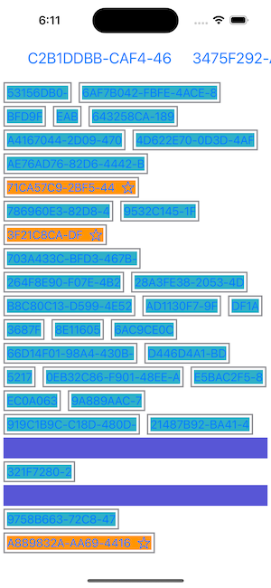
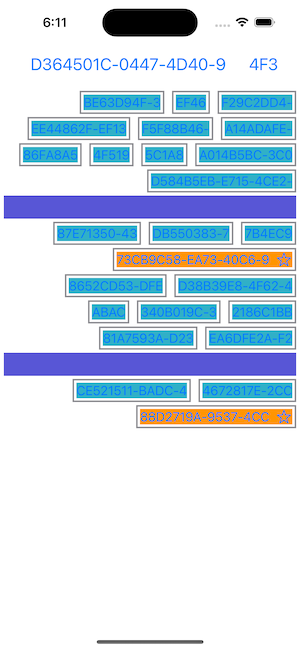

# Tags Cloud Menu
Tags cloud menu in SwiftUI.

Inspired using [robhasacamera](https://github.com/robhasacamera) [gist](https://gist.githubusercontent.com/robhasacamera/379fe5a88fc5bd5cbfddd1994fe5b96a/raw/1154b58d07e893ec29d36c7fc3d97f2efc18374e/WrappingHStack).

Capabilities:
- Leading or traligin menu alignment.
- Cells customization.

| Leading  | Trailing  |
|:----------|:----------|
|  |  |
|  |  |